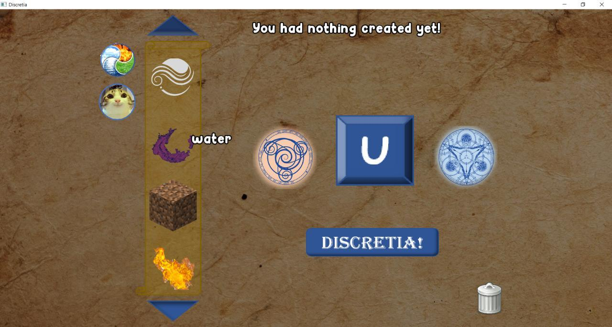
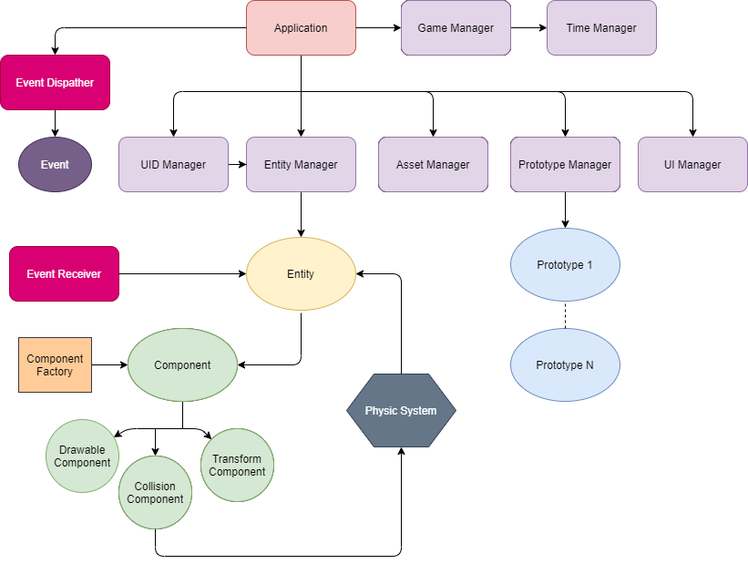

# Discretia!

## Discretia - SFML-based interactive educational game

The purpose of the game is open all games items.  
For that you have to use discrete opertaion.  
You can do **union, complement, intersect, relative complement or even symmetric difference** of items! 
 
Game screenshot:

   
For make solution file on Windows, just simple launch __generate_progects.bat__, if you use Linux or MacOS may God help you
  
For better understanding code here is simplify class diagram 

